Observer <br>in Python
===

<!--

image from [http://refactoring.guru](http://refactoring.guru)
-->

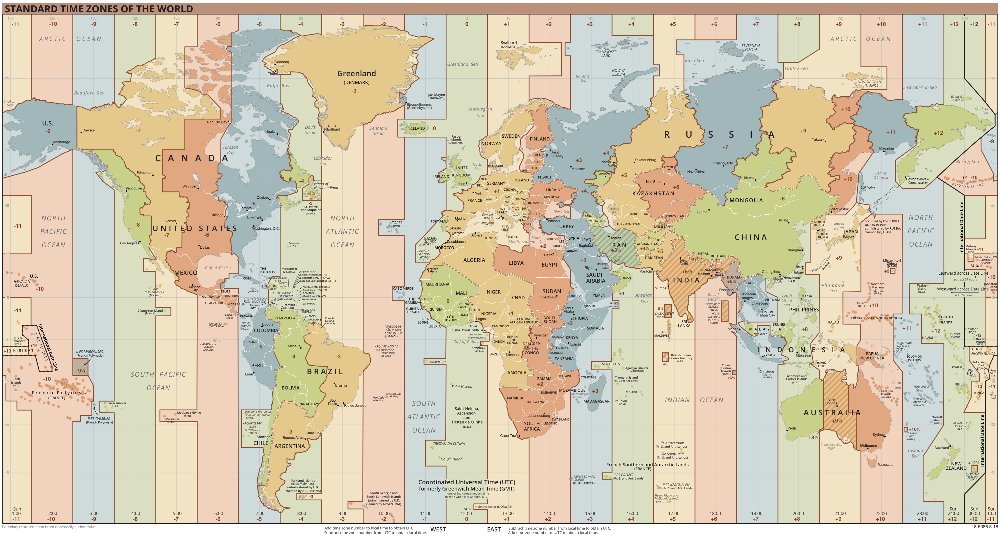

---

Goals
===

- Implement in Python classes *analogous* to Java's ```java.util.Observer``` interface and ```java.util.Observable``` abstract class.

- *analogous* = equivalent functionality, not literal translation, for instance no need of ```hasChanged(), setChanged()```

- Apply them to make desktop clocks that *continuously* show the time of several world time zones

---

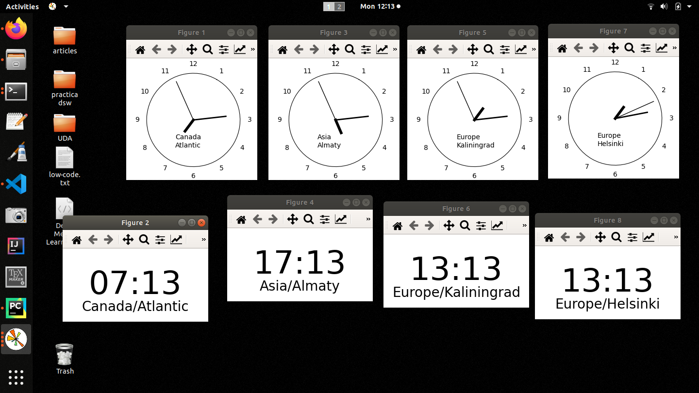

---

*Observer* in ```java.util```
===

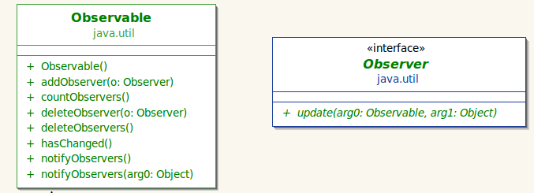

- ``Observable`` is an abstract class with all these methods implemented
- An ``Observable`` keeps a list of its observers (composition not shown here)
- concrete observables inherit them and don't override them
- ``update()`` is abstract and has to be implemented by concrete observers

---

*Observer* in Python
===

Implement just this:

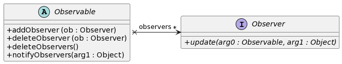

---

Code
===

We are providing some code that paints these **static** clocks, find it here https://github.com/mat-cad/clock_observers_slides

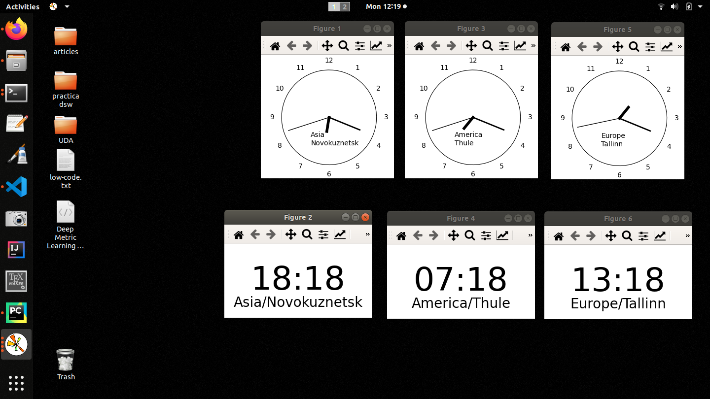


---

## ``Clock``

```python
class Clock:
    def __init__(self, period):
        self.timer = None
        self.period = period  # in seconds but can be float < 1.0

    def start(self):
        self.tick()
        # moving tick() before start maybe slows down the CPU usage
        self.timer = threading.Timer(self.period, self.start)
        # once we do timer.start(), after period seconds run target
        # function self.start, but since we are inside start() this
        # will be done forever
        self.timer.start()

    def tick(self):
        self.datetime = datetime.datetime.now()
        # with attributes year, month, day, hour, minute, second, microsecond
        logging.debug(self.datetime)
```

---

## ``AnalogClock``

```python
class AnalogClock:
    def __init__(self, timezone):
        self.timezone = timezone
        self._draw_clock()

    def _draw_clock(self):
        self.fig = plt.figure(figsize=(2.7, 2.5), dpi=100)
        # ...
        # sentences to draw an analog clock = circle + numbers 1..12 + text time zone
        self._last_time = None
        # if new time - last time >= 1 sec, draw the time

    def _draw_time(self, the_time):
        hour = the_time.hour
        minute = the_time.minute
        second = the_time.second
        angles_h = 2 * np.pi * hour / 12 + 2 * np.pi * minute / (12 * 60) \
                   + 2 * second / (12 * 60 * 60) - np.pi / 6.0
        angles_m = 2 * np.pi * minute / 60 + 2 * np.pi * second / (60 * 60) \
                   - np.pi / 6.0
        angles_s = 2 * np.pi * second / 60 - np.pi / 6.0
        for line in self.ax.get_lines(): line.remove()
        self.ax.plot([angles_s, angles_s], [0, 0.9], color="black", linewidth=1)
        self.ax.plot([angles_m, angles_m], [0, 0.7], color="black", linewidth=2)
        self.ax.plot([angles_h, angles_h], [0, 0.3], color="black", linewidth=4)
        self.fig.canvas.draw_idle()
```

---

### ``DigitalClock``

```python
class DigitalClock:
    def __init__(self, timezone):
        self.timezone = timezone
        self._draw_clock()

    def _draw_clock(self):
        self.handler = plt.figure(figsize=(3, 1.5))
        plt.axis('off')
        plt.axis('tight')
        self._first_time = True
        # if first time, draw the time

    def _draw_time(self, the_time):
        self.handler.clear()
        self.handler.text(0.5,0.5, '{:0>2}:{:0>2}'
                 .format(the_time.hour,
                         the_time.minute),
                 fontsize=48, ha='center', va='center')
        name_tz = self.timezone.zone.replace('_', ' ')
        self.handler.text(0.5, 0.2, name_tz, fontsize=20, ha='center',
                          va='center')
        self.handler.canvas.draw_idle()
        self.handler.show()
```

---

## Client


```python
if __name__ == '__main__':
    clock = Clock(1.0)
    clock.start()
    num_clocks = 3
    timezones = np.random.choice(pytz.common_timezones, num_clocks, replace=False)
    analog_clocks = []
    digital_clocks = []
    for i in range(num_clocks):
        tz = pytz.timezone(timezones[i])
        analog = AnalogClock(tz)
        digital = DigitalClock(tz)
        analog_clocks.append(analog)
        digital_clocks.append(digital)
        # TODO: change the following lines
        dt = datetime.datetime.now() # local date time
        analog._draw_time(dt.astimezone(tz)) # localized date time
        digital._draw_time(dt.astimezone(tz))

    def stop_last_analog_clock():
        pass # TODO

    threading.Timer(10.0, stop_last_analog_clock).start()
    # after 10 seconds stop the last analog clock
```

--- 


In your implementation you have to stop the last created analog clock after 10 seconds starting all the clocks. 

What does it mean to stop a desktop clock ? To stop updating it.

```python
if __name__ == '__main__':
    #...

    def stop_last_analog_clock():
        pass #TODO

    threading.Timer(10.0, stop_last_analog_clock).start()
    # after 10 seconds stop the last analog clock
```

---
Note that rightmost analog clock has a different seconds time because I've stopped it.


---

Countdown timer
===

Now that we have implemented an observable ``Clock`` we can easily add a new type of observer, a countdown timer : given a time *duration*, like 1 minute 10 seconds, start a countdown until 0 secs. :

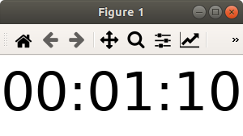 ... 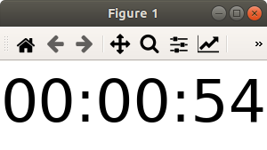 ... 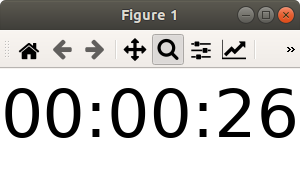 ... 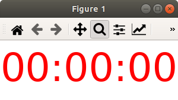

---

## Hints

- package ``datetime`` represents durations with objects of class ``timedelta`` :

    ```python
    td = datetime.timedelta(hours=0,minutes=1,seconds=10)
    ```
- you can perform arithmetic operations on timedeltas :

   ```python
   >>> td1 = datetime.timedelta(seconds=40)
   >>> td2 = datetime.timedelta(seconds=30)
   >>> td3 = td1 + td2
   >>> print(td3)
   0:01:10
   ```
- a ``datetime.timedelta`` object has a method ``total_seconds()`` that returns a float, and an integer attribute ``seconds`` *but not* ``hours``, ``minutes``
- you can write ``handler.text(..., color='red')``
- use ``periode`` of ``Clock``, that could be < 1 sec.

---

Stopwatch
===

- starts at 00:00:00:0
- when you click on it starts counting
- refresh every 0.1 seconds
- click again on it and will pause
- click again and restarts etc.

  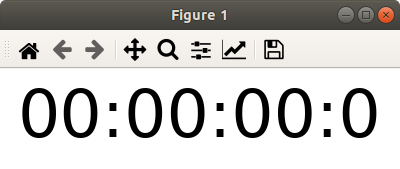...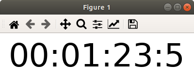

---

## Hints

- how to capture mouse events in Matplotlib
    ```python
    class Stopwatch:
    def __init__(self):
        plt.connect('button_press_event', self._on_click)
        #see https://matplotlib.org/stable/gallery/event_handling/coords_demo.html

    def _on_click(self, event):
        # event not used
        # TODO
    ```

- ``self.duration.total_seconds() - self.duration.seconds`` is the fraction of seconds $\in [0,1.0]$ 

---

Deliverables
===

- Python source code
- detailed PlantUML class diagram, having added concrete observers and observables
- printscreens / gif to show it works


